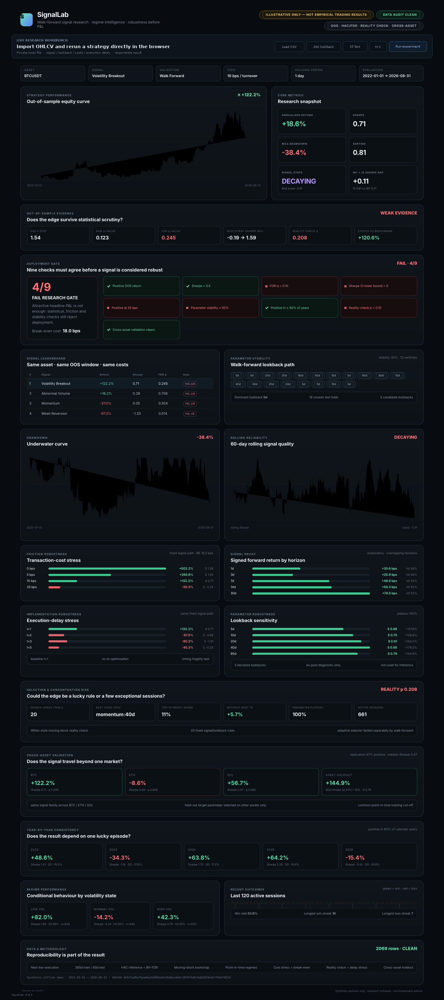

# SignalLab — Market Regime & Strategy Intelligence

SignalLab is a reproducible quant research system built around a harder question than **“did this backtest make money?”**:

> **When does a signal deserve to be trusted, and when is apparent edge just optimisation, timing fragility, regime dependence, or execution friction?**

It combines chronological model selection, point-in-time regime classification, transaction-cost-aware backtesting, multiple-testing controls, search-space diagnostics, implementation stress tests, cross-asset transportability checks, and an interactive research dashboard.



## Why this project

Most portfolio backtests can be made attractive by choosing parameters after seeing the whole sample. SignalLab is deliberately structured to make that optimism visible.

The primary research view is **walk-forward**. Parameters are selected only on trailing data, locked for an unseen block, and evaluated with next-bar execution and turnover costs. The full-sample optimiser is kept only as an explicit comparator.

The repository is organised as research software rather than a notebook: Python for the statistical pipeline, an optional C++/pybind11 backtest loop, React + TypeScript for a deployable interactive dashboard, unit tests for look-ahead invariance, and CI for reproducibility.

## v0.8 — what is implemented

### Live Research Workbench

The dashboard now includes a genuinely interactive browser-side lab. Drop in a daily OHLCV CSV (or raw Binance kline CSV), choose the signal, lookback, costs and execution delay, and rerun the strategy locally without a server. The equity curve and core diagnostics recompute immediately, and the result can be exported as JSON. Imported data never leaves the browser.

The deployed GitHub Pages workflow also builds **real public BTC / ETH / SOL results before deployment**: it downloads Binance monthly archives, verifies published SHA-256 checksums, runs the research engine, asserts that the payload is empirical, and only then builds the React site. The workflow refreshes monthly. See [`docs/LIVE_APP.md`](docs/LIVE_APP.md).

### Research engine

- Four transparent baseline signals: **momentum, mean reversion, abnormal volume, volatility breakout**.
- Candidate lookbacks `{5, 10, 20, 40, 60}`.
- **365-day trailing train / 90-day unseen test** walk-forward selection.
- Common post-warmup evaluation window for walk-forward and in-sample comparison.
- Signal at `t` executes only on the return realised at `t+1`.
- Turnover-based costs charged on the execution bar.
- 0 / 5 / 10 / 25 bps **fixed-path cost stress**.
- Break-even transaction-cost estimate by bisection.
- **Execution-delay stress at t+1 / t+2 / t+3 / t+5** without re-optimisation.
- Point-in-time expanding volatility regimes with future-invariance tests.
- Rolling 60-day signal reliability diagnostics.
- Walk-forward parameter path and stability score.
- Ex-post five-lookback **parameter sensitivity / plateau** diagnostic.
- Best-session removal and return-concentration diagnostics.

### Statistical robustness

- **Newey–West/HAC mean-return t-statistic** with 7 lags.
- **Benjamini–Hochberg FDR correction** across the four displayed signal families.
- **7-day moving-block bootstrap 95% Sharpe interval**.
- Simplified **White-style reality check across 20 pre-declared fixed signal/lookback specifications**.
- Heuristic evidence grade: strong / promising / weak / no evidence.
- Exploratory **signal-decay curve** at 1 / 3 / 7 / 14 / 30-day horizons.
- **Cross-asset replication** across BTC / ETH / SOL plus an **asset-held-out parameter-transfer test**: the target lookback is selected only on the other assets before the common test cut-off.
- Nine-check research gate combining OOS performance, inference, costs, stability, temporal consistency, selection bias and cross-asset transportability.

### Dashboard

- Equity curve and drawdown.
- Walk-forward vs in-sample robustness gap.
- Statistical evidence panel with HAC p-value, FDR q-value, bootstrap Sharpe interval and reality-check p-value.
- Cross-signal leaderboard.
- Walk-forward lookback path.
- Regime-conditional performance.
- Transaction-cost stress and break-even fee.
- **Execution-delay stress.**
- **Lookback sensitivity / parameter plateau.**
- **Selection-bias and return-concentration panel.**
- Signal-decay panel.
- Trade outcome grid and streak diagnostics.
- **Cross-asset validation panel** with replication breadth and held-out-asset transfer.
- **Nine-check research gate** and year-by-year consistency.
- **True browser interactivity:** asset/signal/validation/cost selectors, chart-window presets, hover/tap chart inspection, clickable signal leaderboard, clickable asset/year drill-downs, and session-level trade inspection.
- Shareable filter state encoded in the URL for deployed builds.
- Per-asset data-quality badge tied to a SHA-256 input-file audit.

### Engineering

- Python package + CLI.
- Optional C++/pybind11 backtest implementation using the same execution convention.
- React + TypeScript dashboard.
- GitHub Actions CI.
- **20 passing tests**, including explicit no-look-ahead invariance, data-audit, reality-check, asset-held-out chronology and deployment-gate checks.
- Auto-generated Markdown research report from any dashboard payload.
- Standalone static preview renderer for portfolio screenshots.

## Data

The empirical path uses **public Binance spot kline archives** from `data.binance.vision`; no API key is required. The downloader verifies Binance SHA-256 `CHECKSUM` companions by default and records per-month provenance.

For an offline first launch, the repository includes a **synthetic demo payload**. It exists only so the complete system can be inspected without network access. The dashboard and report label it clearly as illustrative. **Synthetic P&L is not presented as an empirical trading result.**

### Run the public empirical build

The one-command path downloads checksum-verified completed monthly archives, builds the empirical payload, writes the research report and renders the static preview:

```bash
python scripts/run_public_empirical.py \
  --symbols BTCUSDT ETHUSDT SOLUSDT \
  --start 2021-01
```

For manual control, download the market data directly:

```bash
python scripts/download_binance.py \
  --symbols BTCUSDT ETHUSDT SOLUSDT \
  --start 2021-01 \
  --end 2026-08
```

Then build the empirical dashboard payload:

```bash
pip install -e .
signallab build \
  --data-dir data/processed \
  --output dashboard/public/results.json
```

Generate a concise research report:

```bash
signallab report \
  --payload dashboard/public/results.json \
  --output docs/RESEARCH_REPORT.md
```

`results.json` is gitignored so large generated payloads and local market files do not need to live in the repository.

## Run the dashboard

```bash
cd dashboard
npm install
npm run dev
```

The app first looks for `results.json`. If it is absent, it falls back to `demo-results.json` and displays an explicit **offline demo** warning.


## Live interactive dashboard

The screenshot above is only a portfolio preview. The actual dashboard is a **React + TypeScript application**, not a static image. In the browser you can:

- switch BTC / ETH / SOL;
- switch signal family, walk-forward vs in-sample validation, and cost assumptions;
- change the visible chart window (all / 3Y / 1Y / 90D);
- hover or tap the equity, drawdown and reliability charts for point-level values;
- click the signal leaderboard to change the active strategy;
- click cross-asset cards to jump between markets;
- click a calendar year to focus the charts on that year;
- click individual trade cells to inspect the session;
- share the current dashboard state through URL query parameters.

A GitHub Pages workflow is included at `.github/workflows/pages.yml`. Once Pages is enabled with **GitHub Actions** as the source, pushes to `main` automatically publish the dashboard as a real interactive website.

## Reproduce the offline demo

```bash
python scripts/generate_demo_data.py --output-dir data/processed
PYTHONPATH=src python -m signallab.cli build \
  --data-dir data/processed \
  --output dashboard/public/demo-results.json
PYTHONPATH=src python -m signallab.cli report \
  --payload dashboard/public/demo-results.json \
  --output docs/DEMO_RESEARCH_REPORT.md
python scripts/render_preview.py \
  --payload dashboard/public/demo-results.json \
  --output docs/dashboard-preview.html
```

The generated demo report is included at [`docs/DEMO_RESEARCH_REPORT.md`](docs/DEMO_RESEARCH_REPORT.md).

## Validation design

Every walk-forward fold follows the same sequence:

1. take the previous 365 days only;
2. evaluate candidate lookbacks inside that training sample;
3. choose the highest-training-Sharpe lookback;
4. lock it for the next 90 unseen days;
5. repeat forward.

The test suite verifies that **appending future observations cannot change already-created historical walk-forward signals or historical volatility-regime classifications**.

The v0.8 robustness layer then asks additional questions without re-fitting the selected path:

- does the result survive higher fees?
- does it survive a one-to-four-day additional execution delay?
- does it rely on one sharp parameter choice?
- does it rely on a handful of exceptional sessions?
- does the best rule in the declared 20-specification search space still look unusual after a moving-block reality check?
- does the same signal family replicate across other assets?
- if the target asset is completely excluded from parameter selection, does a lookback chosen on the other two assets still transfer?

See [`docs/METHODOLOGY.md`](docs/METHODOLOGY.md) for exact timing, inference procedures and limitations.

## Repository structure

```text
signal-lab/
├── .github/workflows/ci.yml
├── src/signallab/
│   ├── backtest.py
│   ├── data.py
│   ├── data_audit.py
│   ├── pipeline.py
│   ├── regimes.py
│   ├── report.py
│   ├── signals.py
│   ├── stats.py
│   └── walk_forward.py
├── cpp/
│   ├── fast_backtest.cpp
│   └── CMakeLists.txt
├── dashboard/
│   ├── src/
│   └── public/
├── scripts/
│   ├── download_binance.py
│   ├── generate_demo_data.py
│   ├── render_preview.py
│   └── run_public_empirical.py
├── tests/
├── docs/
└── pyproject.toml
```

## Tests

```bash
PYTHONPATH=src pytest
```

Current suite: **20 tests** covering execution timing, cost monotonicity, numerical stability, walk-forward construction, future-data invariance, point-in-time regimes, deterministic block bootstrap, HAC inference, FDR adjustment, White-style search-space reality checking, data-quality audits, cross-asset holdout chronology, robustness payloads and deployment-gate logic.

## C++ module

The optional module mirrors the Python next-bar / turnover-cost convention:

```bash
pip install '.[fast]'
cmake -S cpp -B cpp/build
cmake --build cpp/build --config Release
```

The C++ is intentionally small and auditable rather than spreading another language across code that does not need it.

## Research caveats

SignalLab is a framework for **testing and falsifying** signal reliability. It is not evidence that the included baseline strategies are deployable alpha.

Daily-bar results can be materially altered by venue choice, spreads, slippage, latency, market impact, funding/borrow, survivorship, outages and research degrees of freedom that are not represented in the baseline search. Negative exposure on spot OHLCV should be interpreted as hypothetical linear return exposure unless an explicitly tradeable short/futures implementation is supplied.

The statistical diagnostics reduce several common sources of overstatement; they do not eliminate model risk.

## License

MIT. See [LICENSE](LICENSE).
